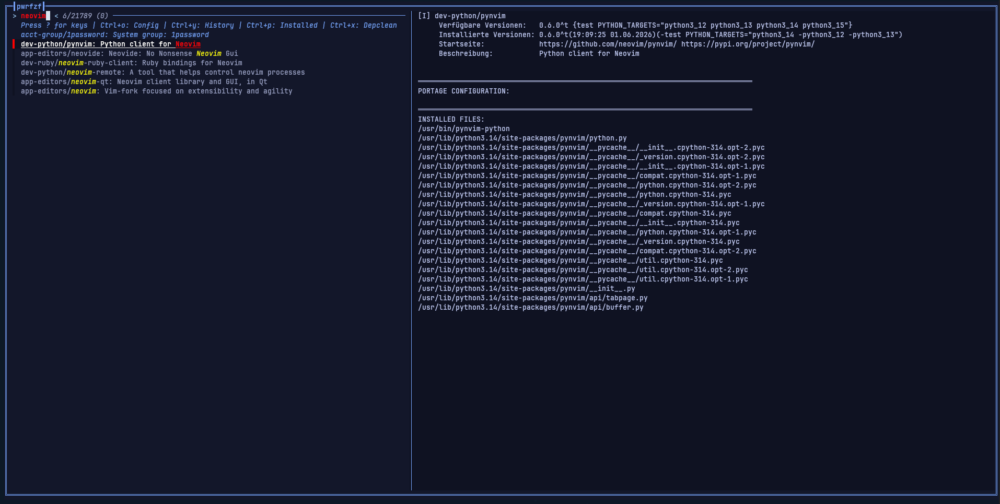
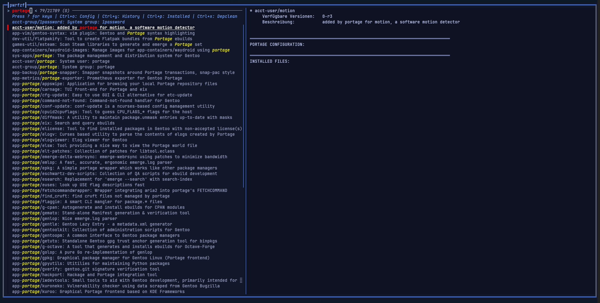
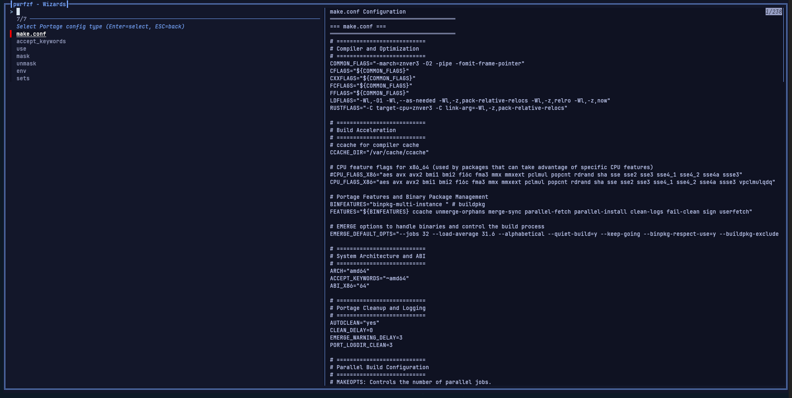
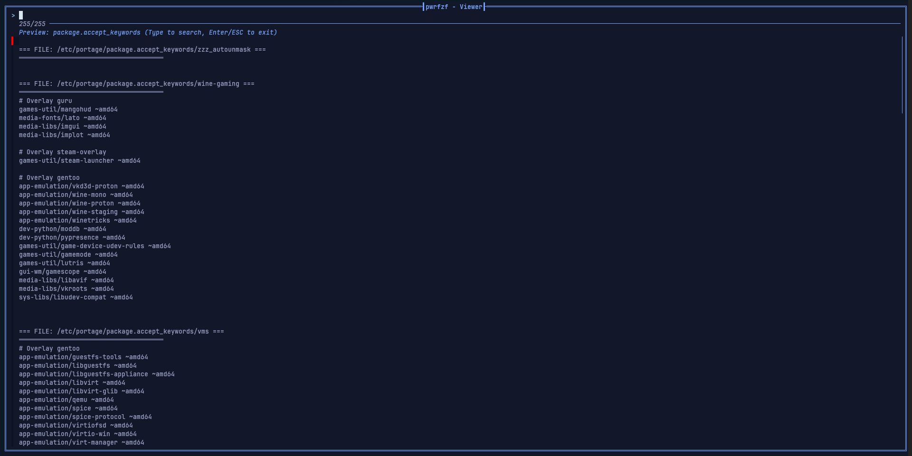
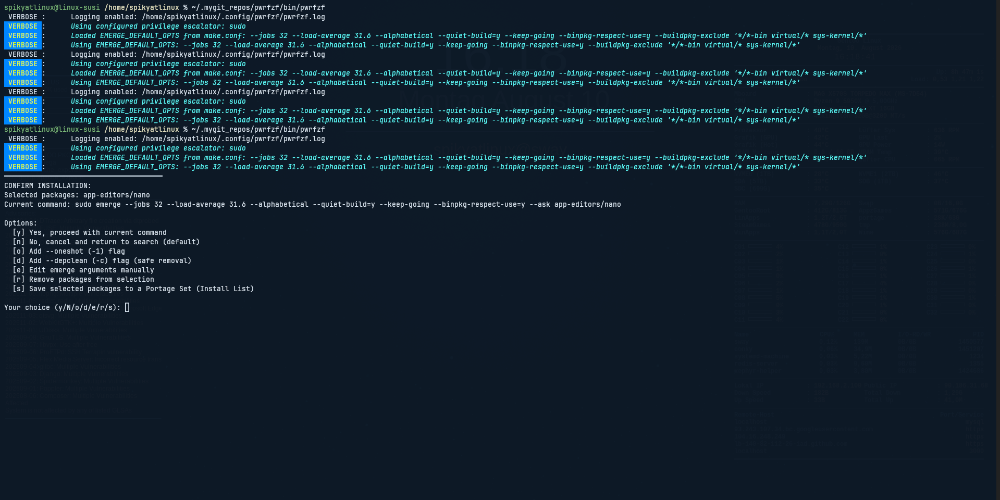

# ⚠️ DISCLAIMER: USE AT YOUR OWN RISK

## IMPORTANT WARNING

**PWRFZF is a powerful but potentially dangerous tool. Improper use can damage your Gentoo system.**

### 🚨 CRITICAL WARNINGS

- **SYSTEM INSTABILITY**: This tool can make significant changes to your system configuration
- **PACKAGE CONFLICTS**: Automated dependency resolution may sometimes break your system
- **CONFIGURATION CHANGES**: Modifies Portage configuration files automatically
- **NO WARRANTY**: This software is provided "as-is" without any guarantees
- **DATA LOSS**: In extreme cases, system damage could lead to data loss

### 🔧 TECHNICAL RISKS

- **Automated unmasking** of packages without manual review
- **USE flag changes** that may break dependencies
- **Keyword additions** that could introduce unstable software
- **Configuration file modifications** that may conflict with manual settings
- **Dependency resolution** that might not always be optimal

### ✅ SAFETY PRECAUTIONS

**BEFORE USING PWRFZF:**
- [ ] Backup important data
- [ ] Create a system snapshot (if using Btrfs/ZFS)
- [ ] Understand Gentoo package management basics
- [ ] Review changes before confirming installation
- [ ] Keep regular backups of `/etc/portage/`

### 🛡️ RECOMMENDED FOR

- **Experienced Gentoo users** who understand the risks
- **Users comfortable with** Portage configuration
- **Those who regularly backup** their systems
- **Developers testing** in controlled environments

### ❌ NOT RECOMMENDED FOR

- **Gentoo beginners** without mentorship
- **Production systems** without proper backups
- **Users unfamiliar with** emerge and Portage
- **Critical systems** where downtime is unacceptable

### 📝 LEGAL DISCLAIMER

THE SOFTWARE IS PROVIDED "AS IS", WITHOUT WARRANTY OF ANY KIND, EXPRESS OR IMPLIED, INCLUDING BUT NOT LIMITED TO THE WARRANTIES OF MERCHANTABILITY, FITNESS FOR A PARTICULAR PURPOSE AND NONINFRINGEMENT. IN NO EVENT SHALL THE AUTHORS OR COPYRIGHT HOLDERS BE LIABLE FOR ANY CLAIM, DAMAGES OR OTHER LIABILITY, WHETHER IN AN ACTION OF CONTRACT, TORT OR OTHERWISE, ARISING FROM, OUT OF OR IN CONNECTION WITH THE SOFTWARE OR THE USE OR OTHER DEALINGS IN THE SOFTWARE.

---

**By using PWRFZF, you acknowledge that you understand these risks and accept full responsibility for any consequences to your system.**

*Last updated: 2026-08-10*

# PWRFZF - Powerful Gentoo Package Manager with FZF

> **A comprehensive interactive package and repository management tool for Gentoo Linux**

[](https://gentoo.org)
[](https://www.gnu.org/software/bash/)
[](https://github.com/junegunn/fzf)

## 🤔 What is PWRFZF?

PWRFZF is an interactive TUI (Text User Interface) that combines the power of Gentoo's Portage with the fuzzy-finding capabilities of FZF. It provides a modern, intuitive interface for package management while maintaining all the flexibility and control that Gentoo users expect.

**Think of it as:** `emerge` + `fzf` + intelligent configuration management

## 🚀 Features

- **🔍 Interactive Package Search** - Fuzzy find packages with instant preview using eix
- **⚡ Smart Installation** - Automatic dependency resolution with circular dependency handling
- **📜 Emerge History** - Built-in history viewer tracking your recently installed/uninstalled packages using genlop or qlop
- **🎨 Beautiful Interface** - Custom color themes with full Unicode support and borders
- **🔧 Complete Portage Config Manager** - Manage ALL Portage configuration files, including a full directory explorer
- **🛡️ Safe Operations** - Confirmation prompts, live emerge argument editing, and automatic configuration fixes
- **📊 Real-time Preview** - Package info, USE flags, installed files, and config status
- **🔄 Auto-Retry System** - Automatic retry with USE flag and keyword fixes
- **🗑️ File Management** - Create, edit, and delete configuration files safely
- **📝 Intelligent** logging system and smart config updating mechanism
- **🔧 Smart package** installation with fallback analysis

## 📸 Screenshots
| Package Search | Installation | Config Management |
| :------------: | :----------: | :---------------: |
|  |  |  |
| *Fuzzy search* | *Smart install* | *Portage config* |

| USE Flag Management | File Operations |
| :-----------------: | :-------------: |
|  |  |
| *Interactive USE* | *File browser* |

## Quick Install
```bash
git clone https://github.com/spikyatlinux/pwrfzf.git
or from mirror
git clone https://git.mysusi.org/spikyatlinux/pwrfzf.git
cd pwrfzf
sudo cp -v ./bin/pwrfzf /usr/local/bin/
```

## Ensure you have the required dependencies installed:
```bash
emerge --ask fzf eix app-portage/portage-utils
```
*(Optional: `app-portage/genlop` for advanced history tracking)*

## Basic Package Management
```bash
# Interactive tui package browser
pwrfzf

# Search for specific packages
pwrfzf firefox

# Open Portage configuration manager
pwrfzf -c

# Run a global system depclean
pwrfzf --depclean

# Sync repositories
pwrfzf --sync

# Run preserved rebuild
pwrfzf --preserved-rebuild

# Show keybindings
pwrfzf -k

# Show version
pwrfzf -V
```

## Configuration file ~/.config/pwrfzf/pwrfzf-config

The configuration file is automatically generated and smartly updated with new variables on startup.

```bash
# PWRFZF Configuration File

# Colors and display
NO_COLOR=false
NO_FX=false

# Behavior
PWRFZF_SHOW_INSTALLED=true
PWRFZF_AUTO_SYNC=false
PWRFZF_CONFIRM_ACTIONS=true
PWRFZF_MAX_PREVIEW_LINES=50
PWRFZF_LOGGING=true

# FZF Layout (reverse = top-down, default = bottom-up)
PWRFZF_FZF_LAYOUT="reverse"

# Search Behavior
# TRUE  = Exact substring match (e.g. 'wine' won't match 'window')
# FALSE = Fuzzy match (e.g. 'wine' matches 'w..i..n..e')
# When false you can use 'wine to search for exact name
PWRFZF_EXACT_SEARCH=true

# Search Targets
# TRUE  = Search ONLY in package names (e.g. app-emulation/wine)
# FALSE = Search in package names AND descriptions
PWRFZF_SEARCH_NAMES_ONLY=false

# History Tool (auto, genlop, qlop, log)
PWRFZF_HISTORY_CMD="auto"

# Emerge behavior
PWRFZF_USE_DEFAULT_EMERGE_OPTS=false
# export EMERGE_DEFAULT_OPTS="$EMERGE_DEFAULT_OPTS --verbose"

# Layout
PWRFZF_PREVIEW_WINDOW="right,60%,border-left"

# Privilege escalation (sudo/doas/empty for root)
PRIV_ESC="sudo"
# PRIV_ESC="doas"
# PRIV_ESC=""  # for root
```

| Option | Description | Default |
|--------|-------------|---------|
| `NO_COLOR` | Disable colored output | `false` |
| `NO_FX` | Disable terminal effects | `false` |
| `PWRFZF_SHOW_INSTALLED` | Show installed packages in search results | `true` |
| `PWRFZF_AUTO_SYNC` | Auto-sync repositories before operations | `false` |
| `PWRFZF_CONFIRM_ACTIONS` | Confirm before installation/removal | `true` |
| `PWRFZF_MAX_PREVIEW_LINES` | Maximum lines in package preview window | `50` |
| `PWRFZF_LOGGING` | Enable logging to file | `false` |
| `PWRFZF_FZF_LAYOUT` | Set FZF layout (`reverse` for top-down, `default` for bottom-up) | `"reverse"` |
| `PWRFZF_EXACT_SEARCH` | Disable fuzzy match (requires exact substring matching) | `true` |
| `PWRFZF_SEARCH_NAMES_ONLY`| Search ONLY in package names, ignore descriptions | `false` |
| `PWRFZF_HISTORY_CMD` | Backend for history viewer (`auto`, `genlop`, `qlop`, `log`) | `"auto"` |
| `PWRFZF_PREVIEW_WINDOW` | FZF preview window position and size | `"right,60%,border-left"` |
| `EMERGE_DEFAULT_OPTS` | Default options passed to emerge command | `"--quiet-build=y --keep-going"` |
| `PRIV_ESC` | Privilege escalation command | `"sudo"` |

## ⌨️ Keybindings Cheat Sheet

### Package Selection & Management

| Key | Action |
|-----|--------|
| TAB | Select / Multi-Select package |
| Shift-TAB | Unselect package |
| Ctrl-d | Deselect all packages |
| Ctrl-i | Toggle current selection |
| Ctrl-r | Force uninstall selected packages (unmerge) |

### System Operations

| Key | Action |
|-----|--------|
| Ctrl-x | Run System Depclean (`emerge --depclean`) |
| Ctrl-w | Update all world packages |
| Ctrl-z | Run preserved rebuild |
| Ctrl-s | Sync repositories |
| Ctrl-p | Toggle view: Show installed packages only vs. all packages |
| Ctrl-y | View Emerge History (Install/Uninstall) |
| Ctrl-o | Open Portage Config Manager |

### Navigation & Search

| Key | Action |
|-----|--------|
| ↑↓ / Ctrl-n / Ctrl-b | Navigate up/down |
| HOME / END | Jump to top/bottom |
| PAGEUP / PAGEDOWN | Page up/down |
| Ctrl-l | Clear query and selection |
| Alt-backspace | Clear query |
| Alt-left | Delete word |
| Change / Typing | Jump to first result |

### Interface Control

| Key | Action |
|-----|--------|
| Ctrl-/ | Change preview window layout |
| Ctrl-v | Toggle preview visibility |
| ? / Ctrl-h | Show keybindings help |
| ESC / Ctrl-q | Exit |

## 📦 Interactive Installation Menu

When confirming an action (`PWRFZF_CONFIRM_ACTIONS=true`), you have access to a powerful interactive prompt:

- `[y]` **Yes**, proceed with current command
- `[n]` **No**, cancel and return to search (default)
- `[o]` **Add --oneshot (-1)** flag to avoid polluting your `@world` file
- `[d]` **Add --depclean (-c)** flag for safe dependency-aware removal
- `[e]` **Edit emerge arguments manually** in a live prompt
- `[r]` **Remove packages** from your current selection via an FZF pop-up menu
- `[s]` **Save selected packages** to a Portage Set in `/etc/portage/sets/` without installing

## 🔧 Portage Configuration Management

Access the comprehensive Portage config manager with `Ctrl-o` or `pwrfzf -c`:

### File Browser Mode
A full directory explorer for `/etc/portage` that detects if you are hovering over a file or a folder, providing `ls -lh` previews for directories and content previews for files using a native, searchable `fzf` viewer.

### Supported Configuration Types

- `make.conf` - Global settings (USE flags, CFLAGS, FEATURES, etc.)
- `package.accept_keywords` - Package keywords and unmasking (~amd64, etc.)
- `package.use` - Package-specific USE flags management
- `package.mask` - Masked packages (block installations)
- `package.unmask` - Unmasked packages (force installations)
- `package.env` - Build environment settings
- `package.sets` - Package sets management

### File Operations Available

- **Preview Files** - View complete file contents using a searchable native FZF pager
- **Edit Files** - Open in your preferred editor (nvim, nano, vim, vi, gedit, kate) instantly
- **Delete Files** - Safe deletion with confirmation
- **Add New Entries** - Interactive entry creation with validation
- **Create New Files** - Intelligent filename suggestions

### Smart Features

- Automatic directory creation for new config files
- Empty directory cleanup after file deletion
- File metadata preview (size, line count, modification date)
- Syntax validation for USE flags and package atoms
- Version-aware package atoms (automatically uses >= format for versioned packages)

## 🛠️ Advanced Features

### Smart Installation Engine

**Circular Dependency Resolution:**
- Automatically detects circular dependencies
- Suggests USE flag changes to break cycles
- Applies fixes automatically or interactively
- Supports --autounmask-use fallback

**USE Flag Management:**
- Interactive USE flag selection for problematic packages
- View current and available USE flags
- Add/remove USE flags with proper package atom formatting
- Batch operations for multiple packages

**Keyword Unmasking:**
- Automatic detection of masked packages
- Interactive keyword selection (~amd64, ~arm64, amd64, etc.)
- Proper package.accept_keywords file management
- Version-aware unmasking

### Intelligent Preview System

**Package Information:**
- Complete eix output with versions and slots
- Installation status ([I] for installed, [ ] for not installed)
- USE flags and keywords
- Size information and download stats

**Configuration Status:**
- Current package.* configuration affecting the package
- USE flag settings from package.use
- Keyword settings from package.accept_keywords
- Mask/unmask status

**File System:**
- Installed files preview (via qlist)
- File metadata in browser views

### Safety Features

**Confirmation Systems:**
- Installation confirmation before proceeding
- File deletion requires typing confirmation
- USE flag changes show before/after preview
- Configuration changes are explicit

**Error Recovery:**
- Automatic retry with configuration fixes
- Clear error messages with suggested solutions
- Fallback options for failed operations
- Built-in syntax error filter for improperly split `EMERGE_DEFAULT_OPTS`

**State Management:**
- Auto-retry with same package selection after config changes
- Proper handling of user cancellations
- Clean terminal state restoration after editor sessions

## 🤝 Contributing
Contributions are welcome! Please feel free to:
- Fork the repository
- Create a feature branch
- Submit pull requests
- Open issues for bugs and feature requests

## 📄 License

This project is licensed under the GNU General Public License v3.0 - see the LICENSE file for details.

## 🙏 Acknowledgments

- Gentoo Linux for the amazing package management system
- FZF for the incredible fuzzy finder
- Eix for fast package searching
- The Gentoo community for continuous inspiration and support

---

### 📝 Changelog: Version 2.2

**✨ New Features:**
* **Emerge History Viewer (`Ctrl-y`):** Added a history tracking tool that parses your unmerge/merge history. Supports `genlop`, `qlop`, or raw `/var/log/emerge.log` files.
* **System Depclean (`Ctrl-x`):** Added a global shortcut and a CLI argument (`--depclean`) to trigger `emerge -a --depclean` instantly.
* **Toggle Installed Packages (`Ctrl-p`):** Seamlessly toggle the live search list between *all* packages and *installed* packages only.
* **Interactive Installation Options:** The confirmation screen now features advanced live-editing capabilities:
    * `[o]` Append `--oneshot` to avoid cluttering the world set.
    * `[d]` Append `--depclean` for safe package removal.
    * `[e]` Edit `emerge` arguments manually in a pre-filled readline prompt.
    * `[r]` Open an FZF pop-up to dynamically drop specific packages from your current selection.
    * `[s]` Save your currently selected packages directly into `/etc/portage/sets/` without installing them.
* **Smart Config Updater:** `pwrfzf-config` now features a smart-append mechanism. If new variables are introduced in future versions, they are automatically appended to your existing config file without overwriting your custom settings.
* **Search Customization:** Added `PWRFZF_EXACT_SEARCH` to disable confusing fuzzy matches (defaulting to exact substring matching) and `PWRFZF_SEARCH_NAMES_ONLY` to restrict searches exclusively to package names.
* **Top-Down Layout Default:** Implemented `PWRFZF_FZF_LAYOUT="reverse"` for a modern, top-down search experience (configurable).

**🚀 Improvements:**
* **Native FZF File Viewer:** Replaced `less -R` with a custom FZF-based file pager. Previews and config files are now fully searchable without breaking the terminal UI.
* **Directory Previews:** The Config Explorer now detects directories on-the-fly and runs a colored `ls -lh` inside the preview pane.
* **Instant Editor Launch:** Removed the disruptive "Press any key to continue" prompts when opening `nvim` or `nano` to maintain a seamless workflow.
* **Smarter Argument Parsing:** Implemented a robust filter that actively ignores complex `make.conf` arguments like `--buildpkg-exclude */*` before they hit the editor prompt, preventing false "invalid package atom" syntax errors in Portage.

**🐛 Bug Fixes:**
* Fixed an issue where `Ctrl-r` (Unmerge) would fail if the package name from FZF contained trailing colons.
* Fixed an array accumulation bug where aborted installations would endlessly duplicate packages and arguments in the background list.
* Fixed the `Ctrl-i` keybinding. Changed from FZF's native `toggle-all` to `toggle` to prevent accidentally queuing the entire portage tree for installation.
* Fixed a bug where `fzf` subshells failed to render the UI elements properly.

<div align="center">
Made with ❤️ for the Gentoo community
If you find this tool useful, please consider giving it a ⭐ on GitHub!
</div>
